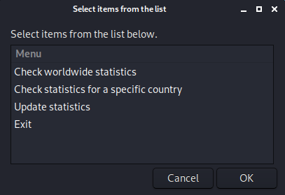
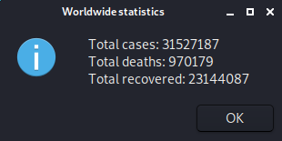
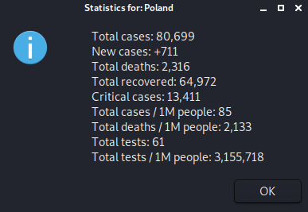

# COVID-19 Statistics

## Sections

 - [Visuals](#visuals)
 - [Description](#description)
	 - [General](#general)
	 - [Main features](#main-features)
	 - [Programming languages and libraries](#programming-languages-and-libraries)
 - [Usage](#usage)
 - [Notes](#notes)
 - [Links](#links)

## Visuals

## Description

### General
University project. Program displays statistics about COVID-19 pandemic

### Main features
- Program allows to check worldwide statistic 
- Program allows to check statistic for each country
- All the data comes from https://www.worldometers.info/coronavirus/
- To search data about specific country user must type English or Polish name of that country (translation accomplished with https://pl.bab.la/slownik/polski-angielski/)

### Programming languages and libraries
 - Bash
 - Zenity

## Usage
 - University project
 
## Notes
 - If program doesn't work properly make sure that you have got installed pcregrep (sudo apt-get install pcregrep)
 - If the site https://www.worldometers.info/coronavirus/ from which all the data comes from changes its HTML structure, then program will not work
 
## Links
- https://www.worldometers.info/coronavirus/
- https://pl.bab.la/slownik/polski-angielski/
